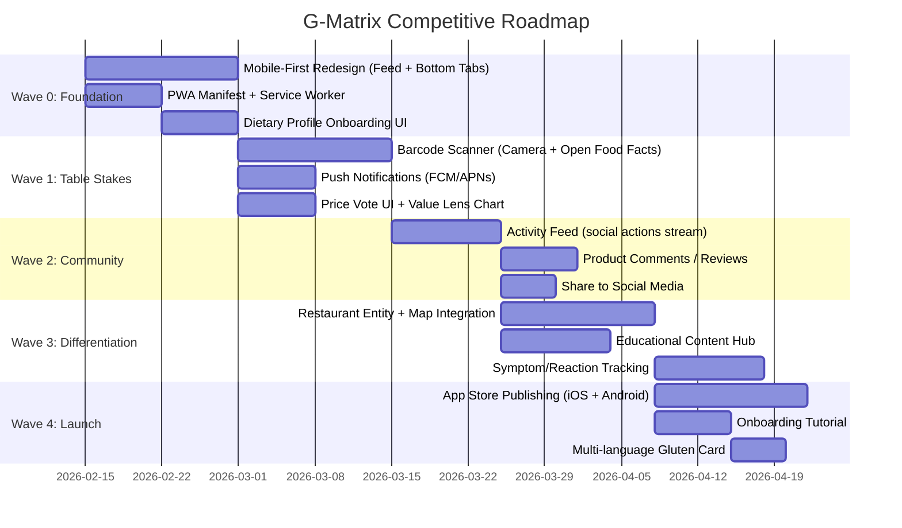

# G-Matrix Competitive Analysis: Gluten-Free & Celiac Apps

## Executive Summary

G-Matrix is a **community-driven product rating app** for gluten-free products. After reviewing 10+ competitor apps on the Play Store and App Store, this analysis identifies what G-Matrix already does well, what the competition offers that G-Matrix lacks, and what would make G-Matrix a **compelling competitive choice** — not just production-ready.

> [!IMPORTANT]
> G-Matrix has a unique value proposition: **2-axis visual product rating (Safety × Taste) with community voting and gamification**. No competitor does this. The goal is to protect this differentiation while closing critical feature gaps.

---

## Competitor Landscape

| App | Platform | Focus | Key Differentiator | Monetization |
|-----|----------|-------|--------------------|-------------|
| **Find Me Gluten Free** | iOS, Android | Restaurant finder | 1M+ crowd-sourced reviews, "Most Celiac Friendly" filter | Freemium ($25/yr) |
| **Fig (Food Is Good)** | iOS, Android | Grocery scanner | Tracks 2,000+ ingredients across allergens, personalized profiles | Freemium (subscription) |
| **The Gluten Free Scanner** | iOS, Android | Barcode scanner | Offline mode, multi-language, scan history | Freemium |
| **The Celiac App** | iOS, Android | All-in-one guide | Dietitian-verified tips, CeliaChat AI, educational resources | Paid |
| **Spoonful** | iOS, Android | Label scanner | Barcode scanning + food discovery, allergen database | Freemium |
| **Spokin** | iOS, Android | Allergy management | City guides, restaurant/bakery finder, travel safety | Free |
| **mySymptoms** | iOS, Android | Symptom tracker | Food diary → symptom correlation, pattern identification | Paid |
| **ShopWell** | iOS, Android | Grocery scanner | Personalized allergen profile, alternative product suggestions | Free |
| **Mealime** | iOS, Android | Meal planning | GF recipe filtering, weekly meal plans, shopping lists | Freemium |
| **Nima Sensor** | iOS, Android + Hardware | Physical gluten test | Tests actual food samples (20ppm FDA standard), community results | Hardware + consumables |

---

## What G-Matrix Already Does Well ✅

These are **competitive strengths** that no single competitor fully replicates:

| Strength | Details | Competitor Comparison |
|----------|---------|----------------------|
| **2-Axis Visual Rating** | Safety × Taste scatter chart with quadrants (Holy Grail, Survivor Food, etc.) | **Unique** — no competitor has this |
| **Gamification** | Points, 7 badges, streaks, leaderboard | Only Find Me Gluten Free has basic reviews; none have gamification |
| **Real-time Updates** | Convex real-time sync — votes update instantly | Most competitors use traditional REST APIs |
| **Anonymous + Authenticated Voting** | Vote without sign-up, migrate votes on registration | Most competitors require accounts |
| **Store-level GPS Tagging** | Each vote can include store location | Find Me Gluten Free has locations, but per-restaurant not per-product-per-store |
| **Niche-Agnostic Architecture** | `app-config.ts` design allows pivoting to vegan, keto, etc. | All competitors are celiac/GF-only |
| **AI Image Analysis** | Gemini-powered ingredient scanning | Fig and Spoonful scan barcodes; AI ingredient analysis is rarer |
| **i18n** | English + Hungarian with live switching | Find Me Gluten Free is English-only; Gluten Free Scanner has multi-lang |
| **Price Tracking** | Price dimension with history schema | No competitor tracks product prices over time |

---

## 🔴 Critical Gaps — Must-Have to Compete

These features are **table stakes** in the gluten-free app market. Without them, users will choose competitors.

### 1. Barcode Scanner
**Every major competitor has this.** Fig, Spoonful, Gluten Free Scanner, and ShopWell all offer barcode scanning.

| What's needed | Status | Priority |
|---------------|--------|----------|
| Camera upload with AI image analysis | ✅ **Implemented** (`@capacitor/camera`, Gemini 2.0 Flash) | — |
| Drag-and-drop image upload | ✅ **Implemented** | — |
| WebP conversion + resize (1024px, 80% quality) | ✅ **Implemented** | — |
| Auto-populate product name + ingredients from AI | ✅ **Implemented** | — |
| **Barcode reading/decoding from camera** | ❌ Not started | **P0** |
| **Product lookup from barcode database (Open Food Facts API)** | ❌ Not started | **P0** |
| Quick-rate after scan ("Scan → Rate → Done" flow) | ⚠️ Partial (AI flow exists, barcode flow missing) | **P1** |

> [!IMPORTANT]
> **What's done:** Camera capture, AI ingredient analysis, auto-fill product details, drag-and-drop upload.  
> **What's missing:** Actual barcode reading (EAN/UPC decoding) and Open Food Facts API integration. Competitors scan barcodes to instantly identify products; G-Matrix requires users to photograph the entire product and relies on AI to extract the name.

### 2. Restaurant/Dining Finder
Find Me Gluten Free has **1M+ restaurant reviews**. G-Matrix only rates products.

| What's needed | Status | Priority |
|---------------|--------|----------|
| Restaurant entity in schema | ❌ Not started | **P1** |
| "Safe restaurants near me" map view | Partial (map exists, but product-only) | **P1** |
| User reviews for restaurants | ❌ Not started | **P2** |
| "Dedicated GF kitchen" filter | ❌ Not started | **P2** |

### 3. Dietary Profile & Personalization
Fig and ShopWell let users set dietary profiles that filter everything.

| What's needed | Status | Priority |
|---------------|--------|----------|
| `dietaryProfiles` table | ✅ Schema exists | **P1** |
| Onboarding flow to set conditions | ❌ No UI | **P1** |
| Personalized safety warnings per user profile | ❌ Not started | **P1** |
| "Safe for you" badge on products | ❌ Not started | **P2** |

### 4. Offline Functionality
Gluten Free Scanner works offline. Users often scan products in stores with poor signal.

| What's needed | Status | Priority |
|---------------|--------|----------|
| Service worker for PWA offline shell | ❌ Not started | **P1** |
| Cache recently viewed products | ❌ Not started | **P2** |
| Queue votes for sync when online | ❌ Not started | **P2** |

---

## 🟡 Important Gaps — Needed to Be a Competitive Choice

These aren't dealbreakers, but their absence makes G-Matrix feel incomplete vs. alternatives.

### 5. Community & Social Features
Find Me Gluten Free and Spokin thrive on community. G-Matrix has follows but no content.

| What's needed | Status | Priority |
|---------------|--------|----------|
| `follows` table | ✅ Schema + backend exists | **P1** |
| Activity feed ("X rated Y as Holy Grail") | ❌ Not started | **P1** |
| Comment on products (not just rate) | ❌ Not started | **P2** |
| Share product to social media / messaging | ❌ Not started | **P2** |
| Community tab or feed page | ❌ Not started | **P2** |

### 6. Symptom/Reaction Tracking
mySymptoms is dedicated to this. It's a major value-add for celiac users.

| What's needed | Status | Priority |
|---------------|--------|----------|
| "How did this product make you feel?" post-consumption log | ❌ Not started | **P2** |
| Symptom diary linked to products | ❌ Not started | **P2** |
| Pattern insights ("Products from Store X cause more reactions") | ❌ Not started | **P3** |

### 7. Recipe & Meal Planning Integration
Mealime and Tasty offer GF recipe filtering.

| What's needed | Status | Priority |
|---------------|--------|----------|
| Recipe suggestions using rated products | ❌ Not started | **P3** |
| Weekly meal plan with GF products | ❌ Not started | **P3** |
| Shopping list from rated products | ❌ Not started | **P3** |

### 8. Educational Content
The Celiac App is built around education. G-Matrix has zero educational content.

| What's needed | Status | Priority |
|---------------|--------|----------|
| "What is Celiac?" beginner guide | ❌ Not started | **P2** |
| Hidden gluten ingredients glossary | ❌ Not started | **P2** |
| Tips for dining out, traveling, etc. | ❌ Not started | **P3** |
| AI chat assistant (CeliaChat equivalent) | ❌ Not started | **P3** |

### 9. Push Notifications
Essential for engagement and retention.

| What's needed | Status | Priority |
|---------------|--------|----------|
| "Your streak is about to expire" reminder | ❌ Not started | **P1** |
| "New product near you" alert | ❌ Not started | **P2** |
| Challenge completion / badge unlock notification | ❌ Not started | **P2** |
| FCM + APNs setup (Capacitor plugin exists) | ❌ Not started | **P1** |

---

## 🟢 Polish Gaps — From "Works" to "Wow"

### 10. Onboarding Experience
| What's needed | Status |
|---------------|--------|
| First-time user tutorial / walkthrough | ❌ |
| "Scan your first product" CTA | ❌ |
| Gamification intro ("Here's how you earn badges") | ❌ |

### 11. Multi-Language Gluten Card
The Gluten Free Card app explains GF diet in 50+ languages for travel.

| What's needed | Status |
|---------------|--------|
| Printable/showable "I have celiac disease" card | ❌ |
| Multi-language support for dining communication | ❌ |

### 12. App Store Presence
| What's needed | Status |
|---------------|--------|
| App Store listing (iOS) via Capacitor | ❌ (Capacitor configured but not published) |
| Play Store listing (Android) via Capacitor | ❌ (Capacitor configured but not published) |
| App Store screenshots, description, keywords | ❌ |
| Privacy policy & terms of service pages | ❌ |

---

## Current State Summary — Where Are We Now?

Based on the docs (`PROJECT_PURPOSE.md`, `ACTION_PLAN.md`, `PRIORITY_CHECKLIST.md`, `FUTURE_PLANS.md`, `REDESIGN_PLAN.md`):

### ✅ Completed (Strong Foundation)
- Full voting system (Safety × Taste × Price, anonymous + authenticated)
- G-Matrix scatter chart with quadrant visualization
- Gamification (7 badges, points, streaks, leaderboard)
- **Camera upload with Capacitor Camera plugin**
- **AI ingredient analysis (Gemini 2.0 Flash with retry logic)**
- **Drag-and-drop image upload**
- **Client-side WebP conversion + resize (1024px, 80% quality)**
- **Auto-populate product name + ingredients from AI analysis**
- Store-level GPS tagging
- Admin dashboard with RBAC
- i18n (EN/HU) with live language switching
- Capacitor setup for iOS/Android
- Security fixes (admin checks, rate limiting, CVE patches)
- Performance optimizations (search indexes, pagination, bundle splitting)
- Schema includes `dietaryProfiles`, `challenges`, `priceHistory`, `reports`, `follows`

### 🔧 In Progress / Designed But Not Built
- Mobile-first redesign (REDESIGN_PLAN.md written, not implemented)
- Feed-based home page (designed, not built)
- Niche-agnostic refactor (app-config.ts designed, partially implemented)
- PWA setup (manifest designed, not deployed)
- Price vote UI (schema ready, no frontend)
- Value Lens chart mode (designed, not built)

### ❌ Not Started (From Priority Checklist)
- **Barcode reading/decoding** (camera upload exists, but no barcode scanner library)
- **Open Food Facts API integration**
- Restaurant finder
- Activity/social feed
- Onboarding flow
- Push notifications (Capacitor plugin installed, not wired up)
- Offline support (PWA manifest designed, service worker not implemented)
- Educational content
- Symptom tracking
- App store publishing

---

## Recommended Priority Roadmap

---

## Bottom Line

| Dimension | G-Matrix vs Competition |
|-----------|------------------------|
| **Product Rating** | 🏆 **Best in class** — 2-axis visual rating is unique |
| **Grocery Shopping** | ❌ **Far behind** — no barcode scanner |
| **Restaurant Finding** | ❌ **Not addressed** — Find Me GF dominates |
| **Engagement** | ⚠️ **Good foundation** — gamification exists, but no push/social feed |
| **Personalization** | ⚠️ **Schema ready, UI missing** — dietary profiles need frontend |
| **Offline** | ❌ **Missing** — critical for in-store use |
| **Education** | ❌ **Missing** — The Celiac App and Spokin lead here |
| **Mobile Experience** | ⚠️ **Designed, not built** — redesign plan exists but not implemented |

**The #1 action to become competitive: Add barcode scanning + complete the mobile-first redesign.** These two features together would transform G-Matrix from a web demo into a real product people would download and use daily.
